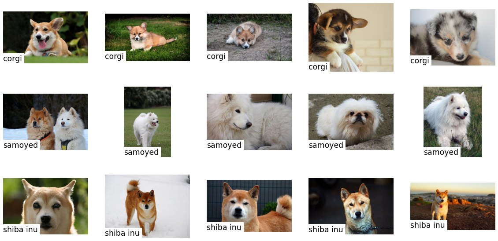
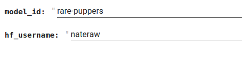

# 🤗🖼️HuggingPics

Fine-tune Vision Transformers for **anything** using images found on the web.

## Usage

Click on the link below to try it out:

## How does it work?

### 1. You define your search terms

### 2. We download ~150 images for each

### 3. You push your model to HuggingFace's Hub to share your results with the world

